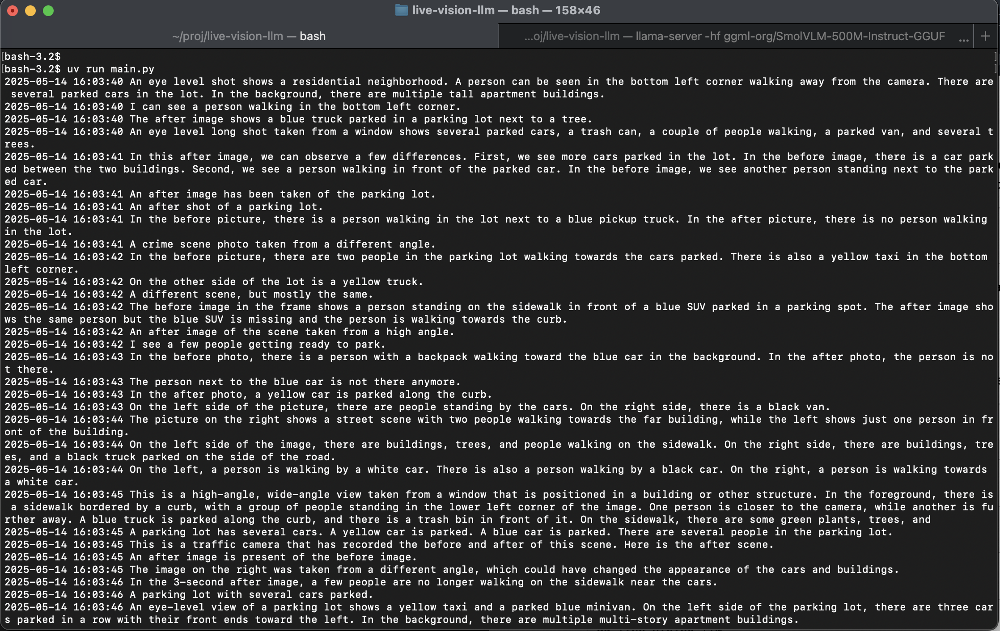

# Real-Time LLM Vision Demo

This project demonstrates **real-time vision capabilities of large language models (LLMs)** using a webcam feed. Images are captured from your laptop camera in real time, sent to a local LLM API endpoint, and the model's response describing the image is logged live.

---

## ✨ What It Does

Inspired 
 [SmolVLM real-time camera demo](https://github.com/ngxson/smolvlm-realtime-webcam) project.
This project serves as a **simple demo** of:

- Real-time image capture from a webcam
- Encoding for API submission
- Interacting with local LLMs that support vision
- Receiving and logging natural language descriptions of what the model "sees"


---

## 🚀 How To Run
Install and run llama.cpp server

```
brew install llama.cpp
llama-server -hf ggml-org/SmolVLM-500M-Instruct-GGUF
```
Clone this repo, install dependencies and run `main.py`

```
git clone https://github.com/facha/live-vision-llm.git
cd live-vision-llm 
uv run main.py
```